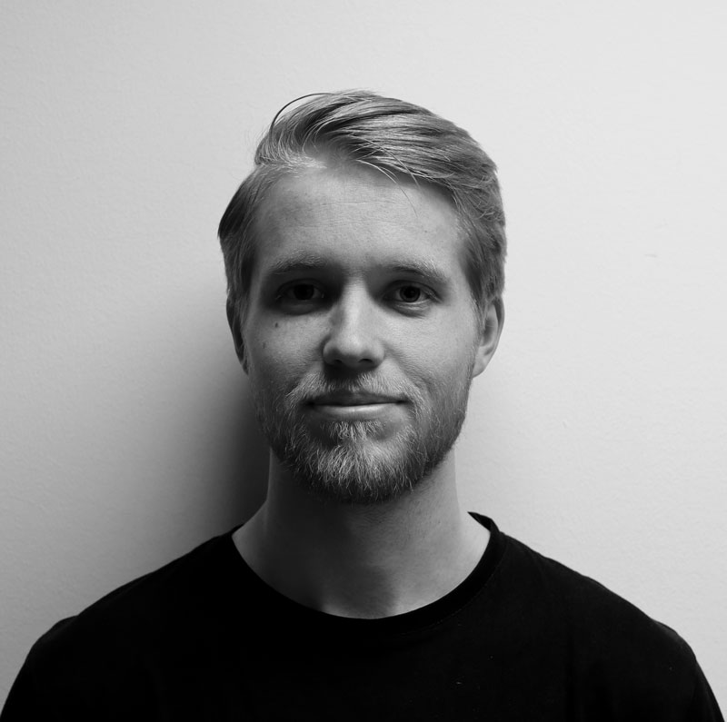
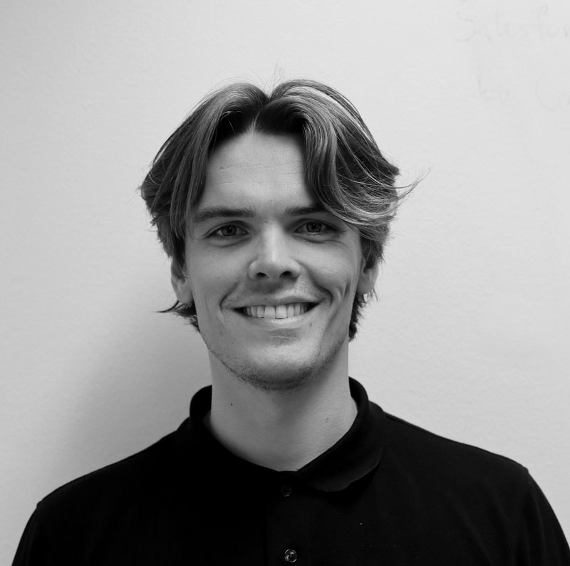
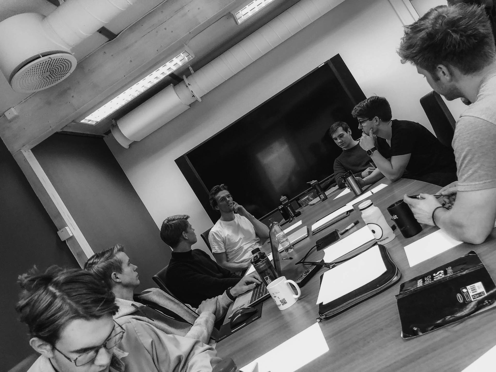

    

        <h2>Work at Ntention</h2>
        Working at Ntention means to strive for changing the world to the better. As curious entrepreneurs and innovators, we’re constantly exploring opportunities to implement new technology and move boundaries in established industries.

  

    <h3>Inspiring</h3>
    Our team is filled with enthusiastic young people who strive towards the same goal. A goal that could fill the urge to innovate and make an impact to change the world for the better.
  

    <h3>Challenging</h3>
    We are working with state-of-the-art technology and doing stuff that no one has done before us. A pioneer company in next-generation and innovative projects that define the future technology.
    

  

  <h3>Surreal</h3>
  A day is never the same. Every week a new adventure are dropping our way. From conferences in Las Vegas to pitching-events in Brazil or China, we are working with companies all around the globe.
  

<h2>Meet some of the people   moving Ntention forward</h2>
  

    

      
      <h6>Lead Hardware Engineer </h6>
      <h2>Sondre Tagestad</h2>
      “I joined Ntention because I was inspired by the vision of the founders. These guys were not afraid to have ambitious goal, something which resonated well with me. We are working with state-of-the-art technology and doing stuff that no one has done before us. Personally, I have grown a lot as a developer since I joined this fast-paced and innovative team, and I’m excited to see what the future will bring.”
    

    

      
      <h6>Chief Financial Officer</h6>
      <h2>Fredrik S. Ahlborg</h2>
      “I believe in our vision, and to change the world for the better. Ntention is my everyday source of inspiration and innovation. For each obstacle and challenge we get trough, we grow as a team. For me the start-up reality is an exciting arena, and a great way to learn and improve myself.”
    

    

      
      <h6>Lead Software Engineer</h6>
      <h2>Håvard P. Brandal</h2>
      “Working in Ntention is exciting for many reasons. One of them are the social experience: The team is made up by interesting people that I enjoy hanging out with both at work and after. Second, I am met with a wide range of problems that challenge my engineering skills. Being in a young start-up company like Ntention, I also have the freedom to pick and choose the problems that I want to work with the most. The start-up life is full of invaluable challenges both socially and professionally that I am sure I will enjoy for the rest of my life.”
    

    

    <h6>Headquarters</h6>
    <h2>Most innovative   student ecosystem.</h2>
    Ntention’s offices are located in the heart of the innovative entreprenuerial ecosystem in Trondheim, Norway. The Norwegian University of Technology and Science (NTNU) is Norway’s top technology university with a wide range of state-of-the-art studies. The Gründerbrakka at NTNU and NTNU’s School of Entrepreneurship houses Ntention’s two offices.
    

    

      
    

