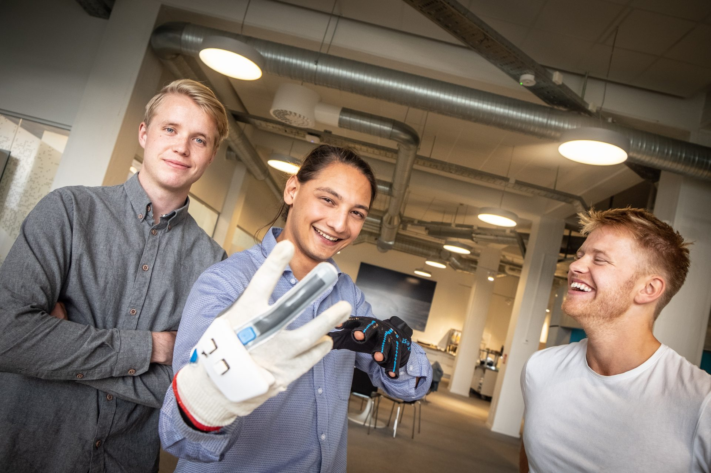

&nbsp;

  
<h6>
About Ntention </h6><h2>
In order to let anyone control any machine we need to make the interaction easy and intuitive.</h2>

  

  Interaction with machines is constantly changing. Automation is increasing, but the number of machines we interact with is also increasing. These conditions require new and easier ways of interacting with machines to allow more people to control greater number of machines with less effort and training. That’s why we are ushering in a new paradigm of control systems.

Ntention are building a system of interaction between the people and the machines that is user centered – not machine centered. The machine will understand the user – not the other way around. Our goal is to understand the intent of the user and translate it to machines. This is how we are moving beyond motion capture and into the world of intention capture.

&nbsp;

&nbsp;

  

    
<a href="/posts/astronaut-smart-glove/">
      
      

        <h6>Astronaut smart glove</h6>
        <h3>Intuitive spacesuits</h3>
      

      </a>
    

    
<a href="/technology/virtual-reality">
      
      

        <h6>Virtual reality</h6>
        <h3>Immersive experience</h3>
      

      </a>
    

<h2>Explore the future of interaction</h2>
 

 

        <a href="/posts/achieving-a-flexible-interaction-system/" class="PostCard">
        

        
        

        

            

            <h3>Achieving a Flexible Interaction System</h3>
            

            <h6>Interaction</h6>
        

        Ntention seeks to solve this problem by creating intelligent software combining multiple input methods with contextual information, to understand the intention behind ...
        

        

       <a href="/posts/an-immersive-user-experience/" class="PostCard">
       

       
       

       

           

           <h3>An Immersive User Experience</h3>
           

           <h6>Interaction</h6>
       

       The modern XR development is disrupting the industry and entertainment sectors. The recent advances open plenty of opportunities for ...
       

       

       <a href="/posts/intuitive-interaction-why-the-time-is-now/" class="PostCard">
       

       
       

       

           

           <h3>Time is now    </h3>
           

           <h6>Interaction</h6>
       

       We are living in a unique time of rapid technological development. The advancement of electronic computers has afforded faster development of many other ...
       

       

 

    

        <h6>Newsletter</h6><h2>Take a seat on our journey</h2>Every other month we send out a newsletter to update everyone interested in our company or journey. We present to you highlights of the last couple of months and priority goals of the next couple of months.  
        <a class="button" href="/subscribe">Subscribe to our newsletter</a>
    

  

        <h6>Work with us</h6>
        <h2>Join the paradigm shift of interaction</h2>
        Do you want to change how humans interact with machines? Going forwards, we aim to create cutting-edge interaction systems in collaborative projects with other companies and industry partners. Are you interested in developing the next generation of interaction systems with us?  
        <a class="button" href="/career">Learn more</a>
    

    

      
    

