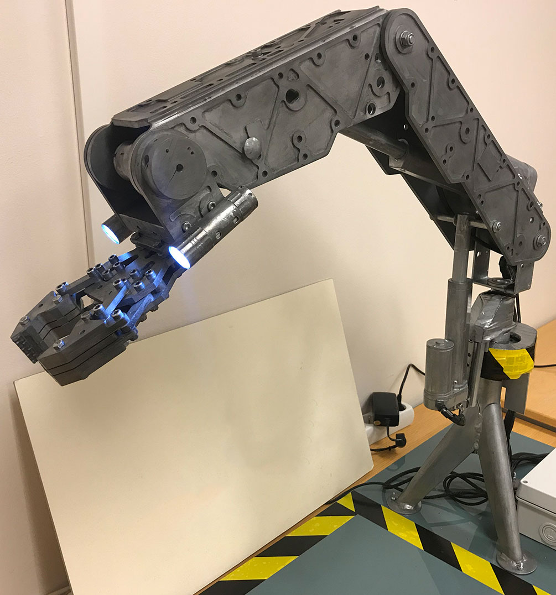

    

        

        <h2>Intuitive Industrial Machines</h2>
        By using natural human motion you can control heavy industrial machines without use any effort or be nearby dangerous areas.
        

    

    

        

            
        

    

    

        <h2>Make heavy industry-work easier</h2>
        

        Ntention delivers an integrated remote-control system for Human-Machine Interaction. Our solution enables users to control and interact with software and machines easily and intuitively.
        

    

      
    

    

    <h6>Value proposition</h6>
    <h2>Reduced training time</h2>
    Our intuitive smart glove prototype was used to control a 7-joint Robotic Arm. We believe the usage areas of gesture-based intuitive control in industry operations are vast and valuable for a wide array of companies. The value proposition will vary between industries and companies, but the scope of value that can be generated across use cases is significant. The most important value proposition is cost savings in training time for operators; The training time associated with traditional control systems can be reduced significantly by making the interaction system more intuitive.   
    

    

        

            At Ntention, we understand you may have unique and custom requirements. Contact us to learn more.
            <a class="button right" href="/contact">Contact</a>
        

    

    

    <h6>interaction system</h6>
    <h2>Safer and faster operations</h2>
    Our intuitive interaction system leads to shorter operation times for tasks; The improved interaction affords reductions in the number of hours of work needed to complete tasks and operations.  
    The technology lower error rates; 75-95% of accidents estimated to be caused by human errors in industry can be lowered significantly. These errors are often related to weak system design. Lacking consideration for the human operators and the human cognition causes these errors.
    

    

        
    

