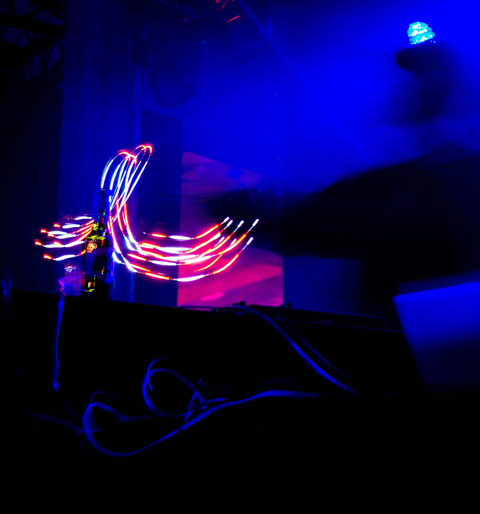

    

        

        <h2>Music Production</h2>
        Combining the HuMI Pro-Glove’s highly accurate data output with the company’s proprietary software, users of the Music Glove can express artistic intentions beyond the scope of any traditional instrument.
        

    

    

        

            
        

    

    

        <h2>Express your intention through art</h2>
        

        The Music Glove project uses the HuMI Pro-Glove to control music applications. It allows the user to intuitively change any musical parameter with hand gestures.  
        

    

      
    

    

    <h6>Artistic intentions</h6>
    <h2>Live performance</h2>
    The Music Glove project uses the Humi Pro-Glove to control music applications. It allows the user to intuitively change any musical parameter with hand gestures. Examples include affecting the tone of a bassline by moving one’s hand up and down, or triggering different notes by moving one’s finger. Combining the Humi Pro-Glove’s highly accurate data output with the company’s proprietary software, users of the Music Glove can express artistic intentions beyond the scope of any traditional instrument.   
    

    

        

            At Ntention, we understand you may have unique and custom requirements. Contact us to learn more.
            <a class="button right" href="/contact">Contact</a>
        

    

<iframe src="https://player.vimeo.com/video/335345100" width="640" height="360" frameborder="0" allow="autoplay; fullscreen" allowfullscreen></iframe>

<a href="https://vimeo.com/335345100">Music Glove demonstration</a> from <a href="https://vimeo.com/ntention">Ntention</a> on <a href="https://vimeo.com">Vimeo</a>.

    

        <h2>We're ready to discuss your next project</h2>
        

        Want to know more about our technology or our current projects? Get in touch, we're ready to support you and assist you with your next project.
        

