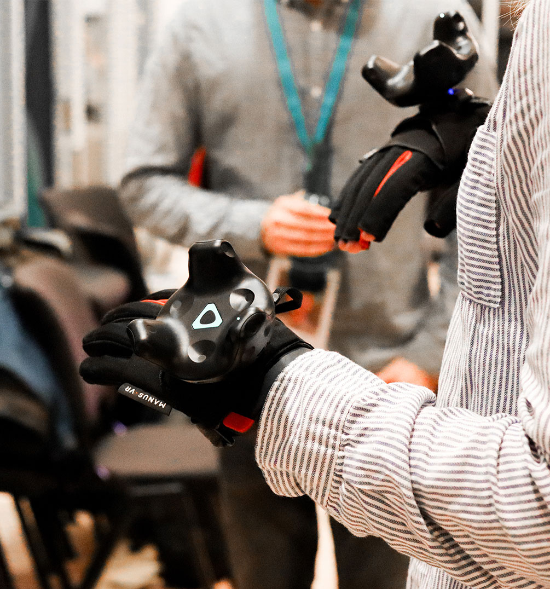

    

        

        <h2>Immersive Real Estate</h2>
        

        Interact with your next home by exploring a virtual mirror of your dream house just like you'd in the real world.
        
  
        

    

    

        

            
        

    

    

        <h2>Sense of ownership</h2>
        

        

        By being able to move furniture and "design their own dream property", the end user will by emotionally invested in the property itself, increasing their interest and increasing the chance of real estate sales.
        

        

    

      
      

        
      

    

    

    <h6>Glove hardware</h6>
    <h2>Sense of touch</h2>
    

    Ntention assist you to choose the right hardware for your specific use. Sensor gloves enables the user to interact with the virtual environment in a natural and intuitive way. When gloves is combined with other senses, especially sight, the amount of information increases dramatically. The increase in information reduces user error, as well as the time it takes to complete a task.   
    Ntention delivers high-quality hardware equipment from one of the global leaders within wearable sensor technology. Follow the link to discover the <a href="/technology/hardware">hardware products</a> that we offer together with our interaction systems.    
    

    

    

        

        

            At Ntention, we understand you may have unique and custom requirements. Contact us to learn more.
            <a class="button gradient right mobile-contact" href="/contact">Contact</a>

        

    

    

    <h6>Virtual property viewings</h6>
    <h2>Interact with your next home</h2>
    

      Ntention provides both the sensor gloves and necessary software to run virtual property viewings. Let your customer jump right into virtual property viewings with a simple button press. The user will be able to put on the sensor gloves and explore properties from different locations on the same office.   
      The ability to create intuitive hand   interfaces   and   gesture-based interaction  in  the  virtual  world  opens  the  possibilities  for  visualization,  3D  modelling, navigation,  manipulation  and  intuitive  cooperation.  Our tailored interaction  systems  let the user explore without any extra setup or training.
      

    

    

        
    

    

        <h2>We're ready to discuss your next project</h2>
        

        

        Want to know more about our technology or our current projects? Get in touch, we're ready to support you and assist you with your next project.
        

        

